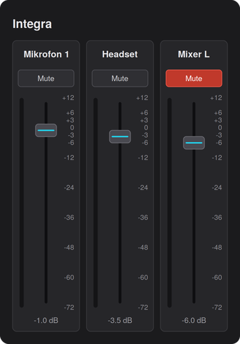

# Work Pro Integra Mixer Card

[](https://github.com/hacs/integration)
[](https://github.com/timonbruns/work-integra-mixer-card/actions/workflows/validate.yml)

A Lovelace card that shows audio channels as a mixing console: a mute button,
a vertical dB fader and an optional level meter per channel. Built for the
[Work Pro Integra integration](https://github.com/timonbruns/WorkPro-Integra),
but works with any `number` (fader) and `switch` (mute) entities.



## Features

- Vertical faders with a dB scale, drag to set the level.
- Mute button per channel (highlights red when muted).
- Optional level meter per channel (needs a level/`sensor` entity).
- Sends the command to the device only on release — one command per move,
  which keeps gentle devices responsive.

## Installation (HACS)

1. In HACS, open the three-dot menu → **Custom repositories**.
2. Add `https://github.com/timonbruns/work-integra-mixer-card` with category
   **Dashboard** (a.k.a. Lovelace/Plugin).
3. Download it and reload your browser (Ctrl/Cmd + Shift + R).

HACS registers the dashboard resource automatically — no manual resource entry
needed.

### Manual installation

Copy `dist/work-integra-mixer-card.js` to `config/www/`, then add it under
**Settings → Dashboards → Resources** as a JavaScript module
(`/local/work-integra-mixer-card.js`).

## Usage

Add a manual card to your dashboard:

```yaml
type: custom:work-integra-mixer-card
title: Integra
height: 300          # optional, fader height in px (default 300)
channels:
  - name: Mikrofon 1
    gain: number.integra_mikrofon_1_lautstarke   # required (the fader)
    mute: switch.integra_mikrofon_1_mute          # optional
    meter: sensor.integra_mikrofon_1_pegel        # optional (level meter)
  - name: Headset
    gain: number.integra_headset_lautstarke
    mute: switch.integra_headset_mute
```

### Options

| Key | Required | Description |
| --- | --- | --- |
| `gain` | yes | A `number` entity used as the fader. Range is read from the entity's `min`/`max`. |
| `mute` | no | A `switch` entity toggled by the Mute button. |
| `meter` | no | A `sensor` entity (dB) shown as a level meter. |
| `name` | no | Overrides the displayed channel name. |
| `title` | no | Card title above the channel strips. |
| `height` | no | Height of the fader area in pixels. |

The card range follows each fader's own `min`/`max` attributes (the Integra
uses −72 … +12 dB). The dB scale labels are fixed markers for orientation.

## License

[MIT](LICENSE)
